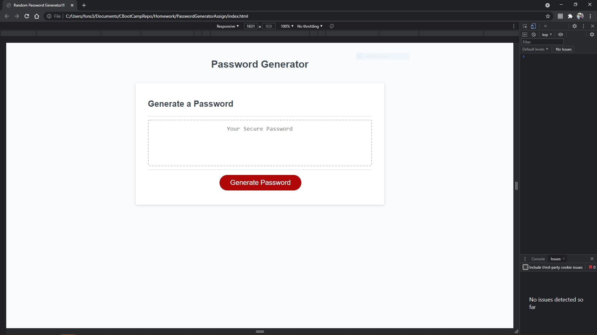

# Homework Password Generator: 

* Due date: 08/14/2021

## PasswordGeneratorAssign Description:

* In this weeks' homework assignment, a password needs to be generated using randomly selected characters from a list of strings. 

* Pseudocode has been implemented for clarity and comprehension

### Link to deployed site; Screenshot of up-to-date site;

* 

* Repository contains quality readme file with description, screenshot, and link to deployed application.

## Review

You are required to submit the following for review:

* The URL of the deployed application.

* The URL of the GitHub repository, with a unique name and a readme describing the project.

- - -
© 2021 Trilogy Education Services, LLC, a 2U, Inc. brand. Confidential and Proprietary. All Rights Reserved.
